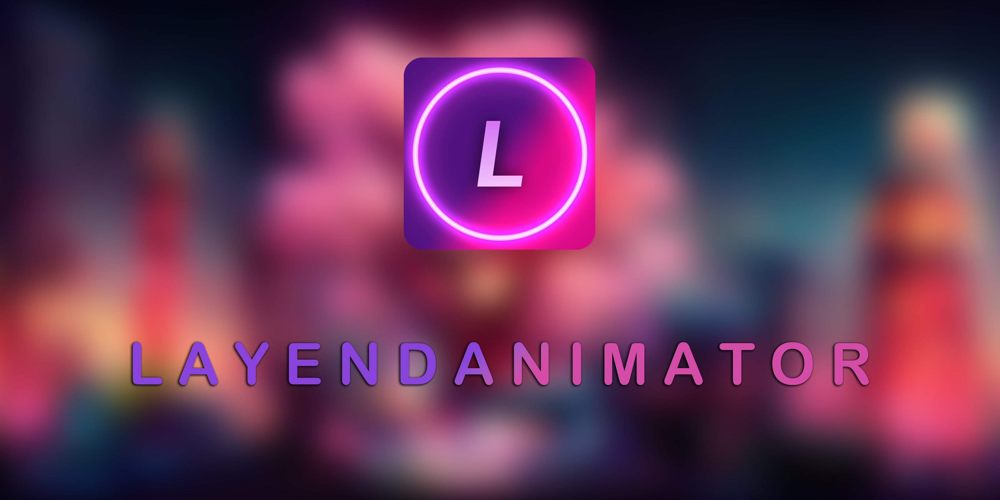
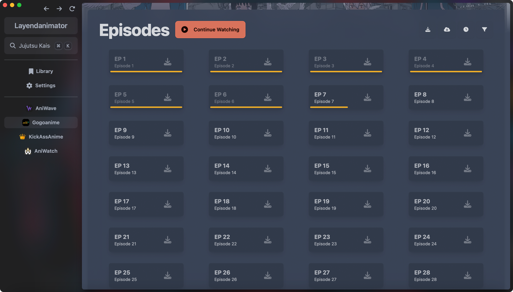
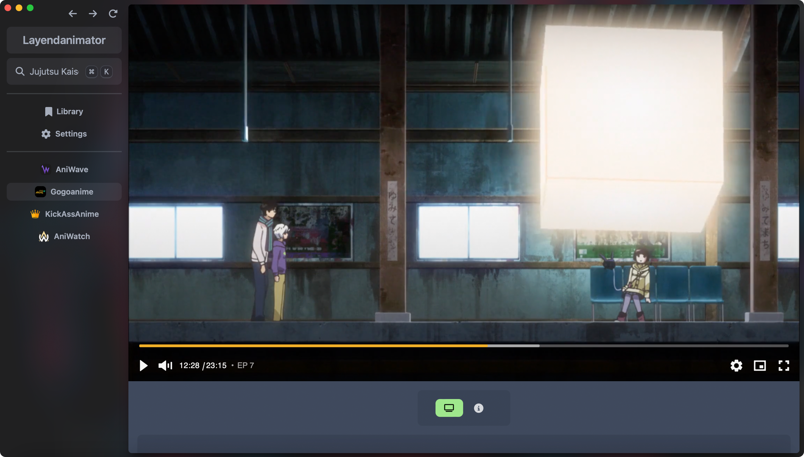
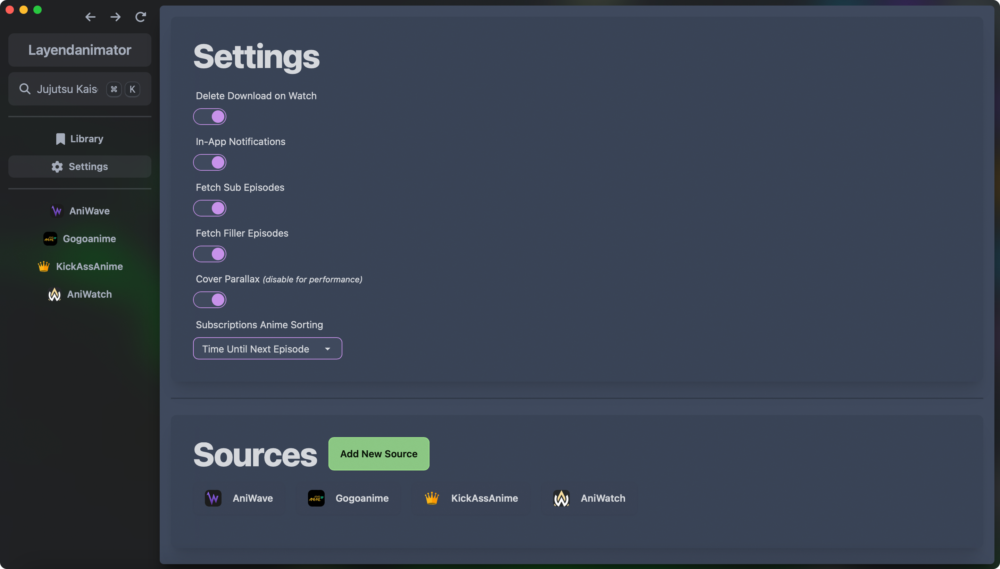
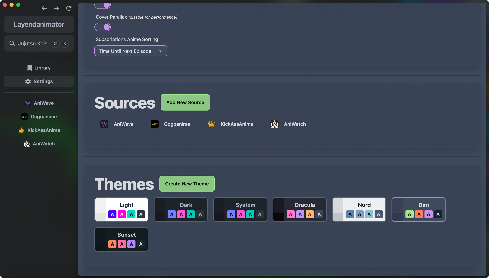
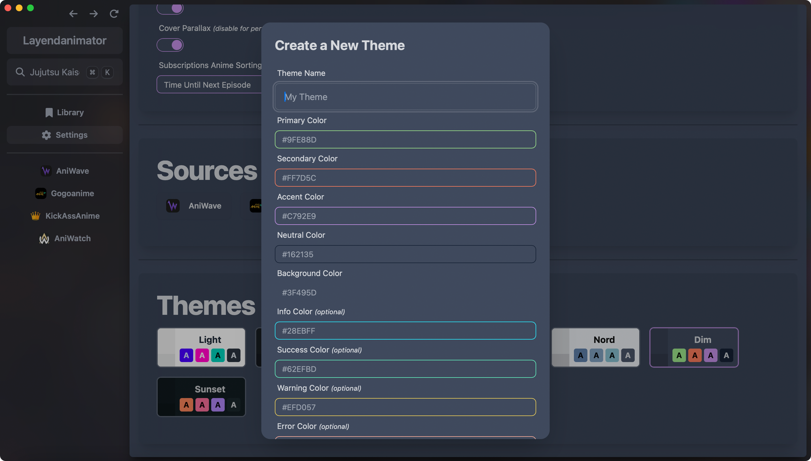

# 

  
  
  
  
  

A simple yet elegant way of waching anime on your favorite anime websites.
Layendanimator is a free and open source anime watching app for Desktop (Windows, MacOS, Linux), using [Sveltekit](https://github.com/sveltejs/kit) and [Tauri](https://github.com/tauri-apps/tauri).

## Table of Contents

- [Layendanimator](/#)
  - [Table of Contents](#table-of-contents)
  - [Getting Started](#getting-started)
  - [Features](#features)
  - [Picture in Picture Playback](#picture-in-picture-playback)
  - [Notifications & Subscription](#notifications--subscription)
  - [Download Episodes](#download-episodes)
  - [Google Cast](#google-cast)
  - [Screenshots](#screenshots)
    - [Dark Theme](#dark-theme)
    - [Light Theme](#light-theme)
    - [Custom Themes](#custom-themes)
    - [Main Page](#main-page)
    - [Anime Page](#anime-page)
    - [Player](#player)
    - [Search](#search)
    - [Library](#library)
    - [Settings](#settings)
  - [Contributions](#contributions)
  - [License](#license)

## Getting Started

- [Set up Tauri](https://tauri.app/v1/guides/getting-started/prerequisites)

(Will add more on how to contribute later)

## Features

- [x] Ads Free and no logins
- [x] Super-duper clean UIs + Dark Mode
- [x] Get notifications when new episodes come out
- [x] Custom video playback interface
- [x] Picture in Picture playback
- [ ] Chromecast/Google Cast integration
- [x] Playback History & Auto Resumes
- [ ] Support Custom Sources (WIP)
- [ ] Discord Rich Presence integration
- [x] Download & play episodes offline
- [ ] Third party anime
- [ ] Custom anime lists, e.g. favorites and to-watch list

## Picture in Picture Playback

Watch anime in a small window while doing other things on your computer.

To use Picture in Picture playback, click on the Picture in Picture button at the bottom right on the video player.

## Notifications & Subscription

Automatically receive notifications when new episodes of animes you subscribed to come out.

_Note: Notifications will only be sent if the app is open, it will not notify you if the app is closed._

## Download Episodes

Download episodes to watch offline.

To download an episode, click on the download button at the bottom right of an episode card.

You can view your downloaded content in the settings tab.

## Google Cast

WIP

## Screenshots

### Themes

#### Dark Theme

#### Light Theme

#### Custom Themes

### Main Page

### Anime Page

### Player

### Search

### Library

### Settings

## Contributions

Thanks to the following people for contributing to this project.

 

I also want to thank the following projects and people for ideas and inspiration.

- [NineAnimator](https://github.com/SuperMarcus/NineAnimator)
- [Anilist](https://anilist.co/home)
- [Consumet API](https://github.com/consumet/api.consumet.org)
- [DaisyUI](https://daisyui.com/)

- [Vilian](https://github.com/Fractal-Tess)
- [NotErik](https://github.com/ErrorErrorError)
- [Inamaki](https://github.com/inumakieu)

As well as everyone in the NineAnimator, Consumet, Tauri, and Svelte discord servers for their feedback and helping me squash bugs.

Thank you to idiocymax for making the Layendanimator logo.

## License

This project uses the [GNU General Public License v3.0](https://www.gnu.org/licenses/gpl-3.0.en.html)
